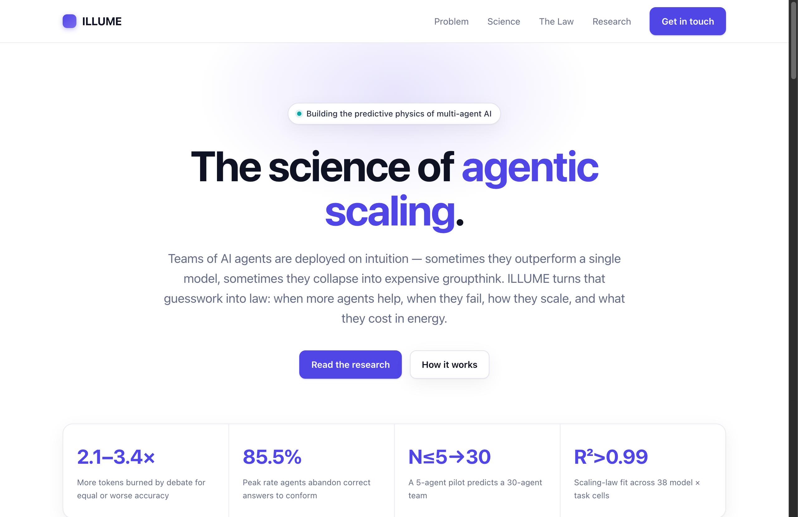

# ILLUME — The Science of Agentic Scaling

Teams of AI agents are deployed on intuition — sometimes they outperform a single
model, sometimes they collapse into expensive groupthink. **ILLUME turns that guesswork
into law**: when more agents help, when they fail, how they scale, and what they cost
in energy.

**→ [agenticscaling.github.io](https://agenticscaling.github.io)**

## Research

1. **The Cost of Consensus: Isolated Self-Correction Prevails Over Unguided Homogeneous
   Multi-Agent Debate.** *CAIS '26 — Conference on AI & Agentic Systems.*
   ★ Industry Spotlight — invited presentation at the AI Engineer World's Fair
   (San Francisco, June 2026).

2. **The Ringelmann Effect in Multi-Agent LLM Systems: A Scaling Law for Effective
   Team Size.** *Coming in 2026.*

## About this repository

This is the organization Pages site — a single, dependency-free static page
(`index.html`); no build step, no frameworks. Pushing to `main` deploys it.

## Contact

Collaboration, funding, or deployment questions:
[sensorlab.jsi@gmail.com](mailto:sensorlab.jsi@gmail.com)
